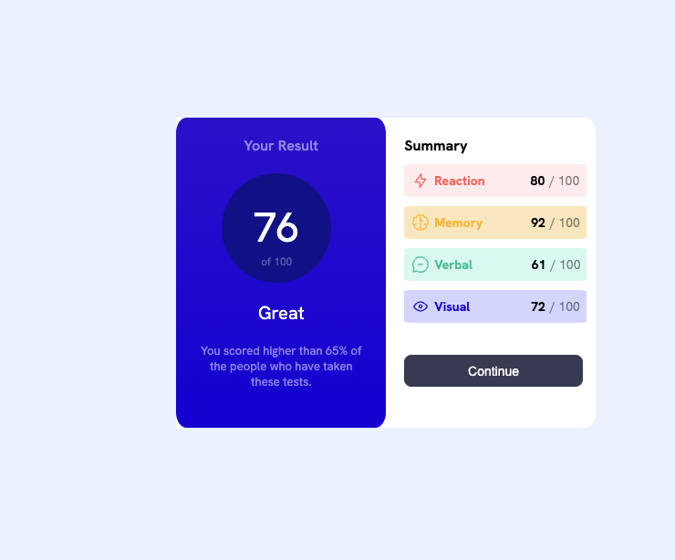
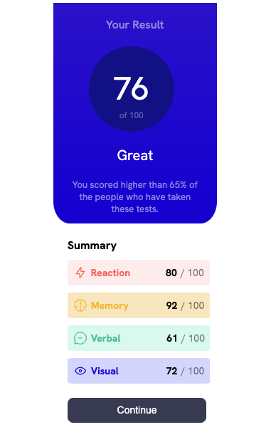

## Overview

Users should be able to:

- View the optimal layout for the interface depending on their device's screen size
- See hover and focus states for all interactive elements on the page
- **Bonus**: Use the local JSON data to dynamically populate the content

### Screenshot
Web

Mobile

## Links

- Solution URL: [solution URL](https://your-solution-url.com](https://github.com/gkuzivam/result-summary-app))
- Live Site URL: [live site](https://gkuzivam.github.io/result-summary-app/result-summary-app/)

## Built with

- Semantic HTML5 markup
- CSS custom properties
- Flexbox
- Angular
